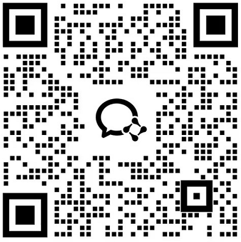

# IC Coder

IC Coder是一款**The Agentic AI Verilog Coding Platform（自主式人工智能 Verilog 编码平台）**。我们立志于用AI重塑芯片开发者的效率，将芯片设计与验证的效率提升至少20倍！让芯片开发者们，都能享受到AI发展所带来的科技福利！目标成为全球最好用的"LLM生成Verilog"的平台！

IC Coder共有三个产品形态，分别是**插件端，web端，IDE端**

欢迎扫码添加群，讨论漏洞或功能请求！

# 立即开始

欢迎访问[我们的网站](https://www.iccoder.com/)来感受IC Coder的魅力。

# 关于我

蔡杰涛

IC Coder 创始人 & CEO

- 近10年FPGA&数字IC从业经历
- 创业三年，从零开始组建/带领/培养团队，团队峰值管理超50人
- FPGA技术专家，全网粉丝1W+，技术博客全网阅读量500W+
- IC Coder创始人，带领团队深耕AI智能体开发3年，发布了全球首款Verilog智能体平台，用户量已超1万+

