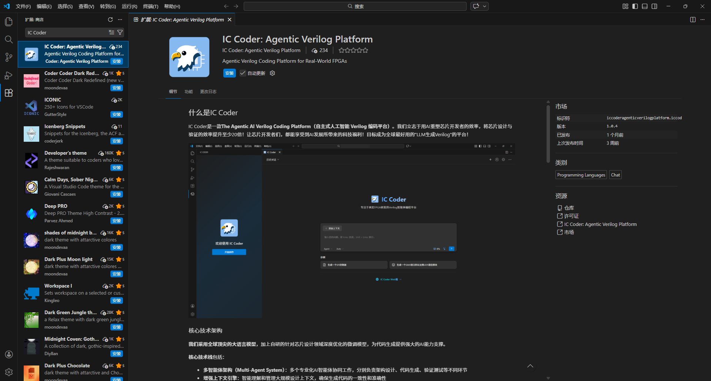
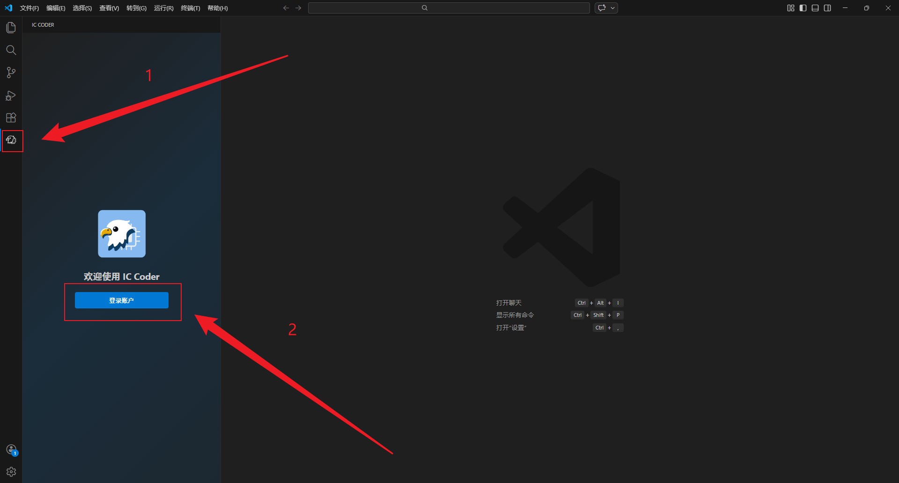
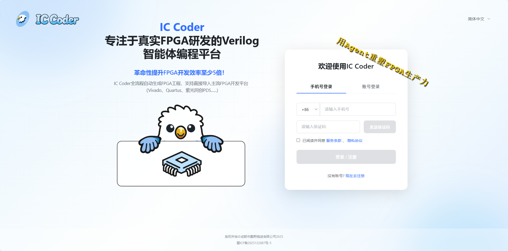
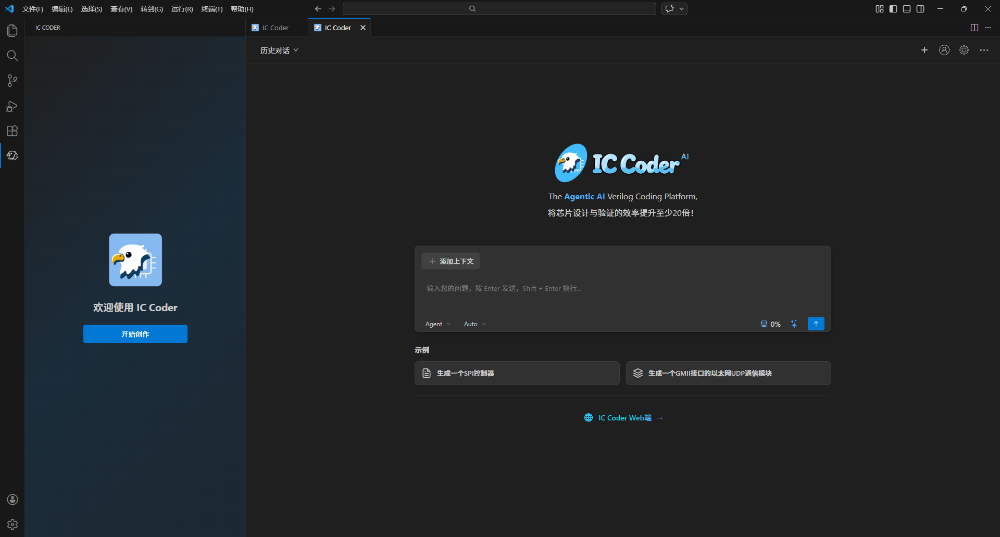
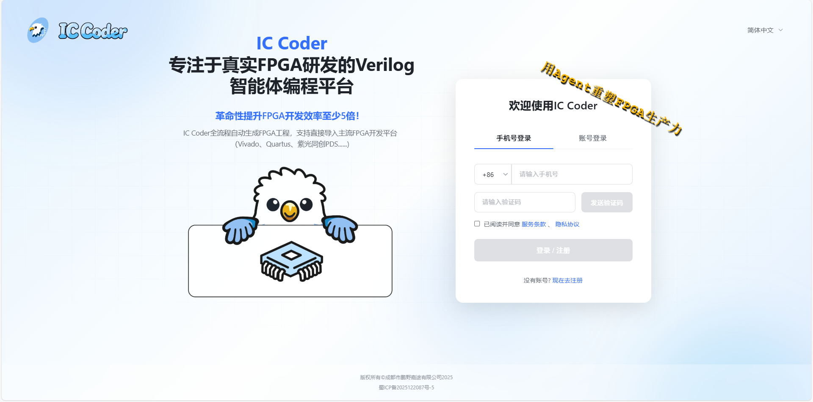
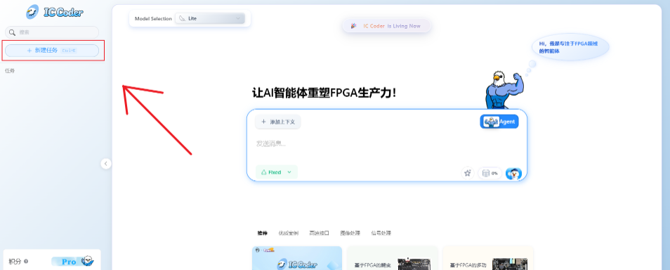
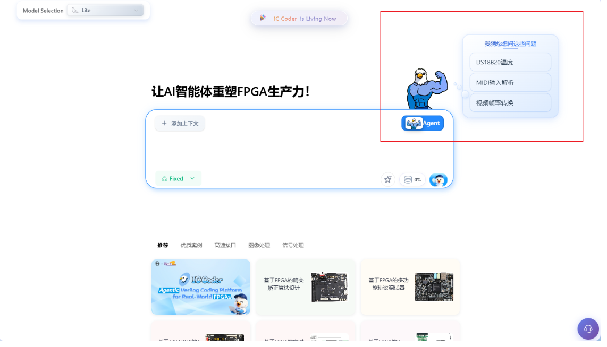

# IC Coder

IC Coder是一款**The Agentic AI Verilog Coding Platform（自主式人工智能 Verilog 编码平台）**。我们立志于用AI重塑芯片开发者的效率，将芯片设计与验证的效率提升至少20倍！让芯片开发者们，都能享受到AI发展所带来的科技福利！目标成为全球最好用的"LLM生成Verilog"的平台！

IC Coder共有三个产品形态，分别是**插件端，web端，IDE端**

## 插件端

浏览器插件形式，随时随地使用，无需安装额外软件。可在VSCode中下载体验。

### 系统要求

- Visual Studio Code 版本需在 1.60.0 及以上

### 安装步骤

#### 第一步：获取插件

1. 启动 Visual Studio Code 编辑器
2. 点击左侧活动栏的扩展图标（或使用快捷键 `Ctrl+Shift+X`）
3. 在搜索框中输入 "IC Coder"
4. 找到 IC Coder 插件后，点击"安装"按钮
5. 安装完成后，重新启动 VS Code 使插件生效

#### 第二步：账号登录

1. 在 VS Code 左侧活动栏找到 IC Coder 图标并点击

2. 在打开的侧边栏中，点击**登录**按钮

   

3. 浏览器会自动打开登录页面，使用你的 IC Coder 账号完成登录

   

   

4. 登录成功后返回 VS Code

### 开始使用

现在你已经完成了所有配置，可以在 IC Coder 对话框中开始与 AI 助手交流，享受Vibe Verilog Coding！

## Web端

网页版本，跨平台访问，支持所有现代浏览器。

### 使用步骤

1、进入IC Coder的官网 https://www.iccoder.com

2、登录/注册，登录IC Coder

3、登录成功，进入对话页面

3、点击左侧边栏的"新建"按钮

4、输入你的需求

**直接输入，就像跟人说话一样：**

**你还可以点击吉祥物，获取问题灵感：**

**不用担心写得不完美，后面有"一键优化"功能。**

**点击发送就大功告成啦！只需要等待IC Coder为您产出完整的项目文档。**

## IDE端

集成开发环境插件，深度融入开发工作流程。

敬请期待！

# 关于我

蔡杰涛

IC Coder 创始人 & CEO

- 近10年FPGA&数字IC从业经历，曾任职于清华紫光集团
- 创业三年，从零开始组建/带领/培养团队，团队峰值管理超50人
- FPGA技术专家，全网粉丝1W+，技术博客全网阅读量500W+
- IC Coder创始人，带领团队深耕AI智能体开发3年，发布了全球首款Verilog智能体平台，用户量已超1万+

